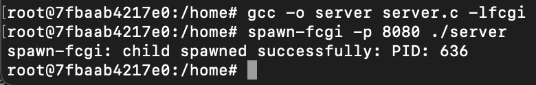
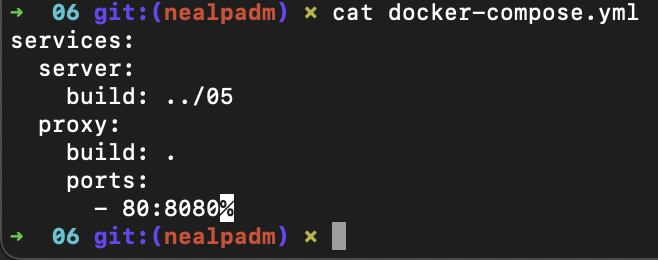
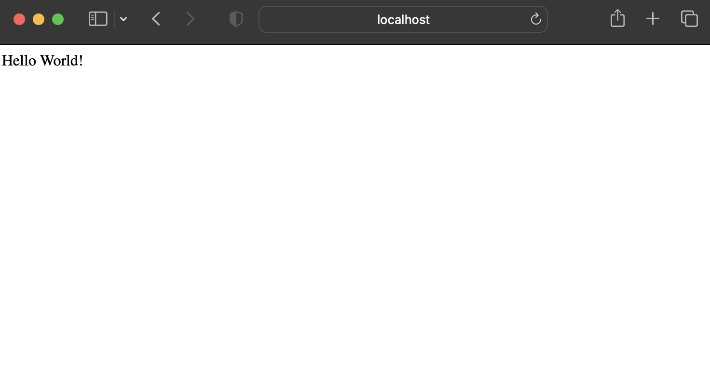
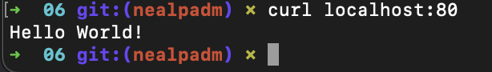

##Part 1. Готовый докер

- **Взяли официальный докер образ с nginx и выкачали его при помощи `docker pull`**

- **Проверили наличие докер образа через `docker images`**

- **Запустили докер образ через `docker run -d [image_id|repository]`**

> **-d:** это флаг, который указывает Docker на запуск контейнера в фоновом режиме (detached mode). Это означает, что контейнер будет работать в фоновом режиме, и командная строка будет освобождена для дальнейшего использования.
>

- **Проверили, что образ запустился через `docker ps`**

>Команда `docker ps` используется для вывода списка запущенных контейнеров Docker.  
>При запуске команды `docker ps` без дополнительных флагов будут отображены только запущенные контейнеры в текущий момент времени.
>

- **Посмотрели информацию о контейнере через `docker inspect [container_id|container_name]`**

- размер контейнера  

- список замапленных портов  

>Маппинг нужен для того, чтобы все запросы, проходящие через порт хоста, перенаправлялись в Docker-контейнер. Другими словами, сопоставление портов делает процессы внутри контейнера доступными извне.
>

- ip контейнера

- **Остановили докер образ через `docker stop [container_id|container_name]` и проверили, что образ остановился через `docker ps`**

- **Запустили докер с портами 80 и 443 в контейнере, замапленными на такие же порты на локальной машине, через команду `run`**

- **Проверили, что в браузере по адресу *localhost:80* доступна стартовая страница `nginx`**

- **Перезапустили докер контейнер через `docker restart [container_id|container_name]` и проверили, что контейнер запустился**

---

##Part 2. Операции с контейнером

- **Прочитали конфигурационный файл `nginx.conf` внутри докер контейнера через команду `exec`**

- **Создали на локальной машине файл `nginx.conf`**
`nano nginx.conf`

- **Настроили в нем по пути `/status` отдачу страницы статуса сервера `nginx`**

- **Скопировали созданный файл `nginx.conf` внутрь докер образа через команду `docker cp`**

- **Перезапустили `nginx` внутри докер образа через команду `exec`**

- **Проверили, что по адресу `localhost:80/status` отдается страничка со статусом сервера `nginx`**

- **Экспортировали контейнер в файл `container.tar` через команду `export`и остановили контейнер**

- **Удалили образ через `docker rmi [image_id|repository]`, не удаляя перед этим контейнеры**

- **Удалили остановленный контейнер**

- **Импортировали контейнер обратно через команду `import`**

- **Запустили импортированный контейнер**

- **Проверили, что по адресу `localhost:80/status` отдается страничка со статусом сервера `nginx`**

---

##Part 3. Мини веб-сервер

- **Написали мини сервер на C и FastCgi, который будет возвращать простейшую страничку с надписью Hello World!**

- **Написали свой nginx.conf, который будет проксировать все запросы с 81 порта на 127.0.0.1:8080**

	- Скопировали созданный nginx.conf и мини сервер в контейнер и зашли в него. 
	
	
	> **-y** опция команды `apt-get` указывает на автоматическое подтверждение установки пакетов без запроса подтверждения от пользователя. Это полезно при автоматической установке пакетов в скриптах или в среде контейнеров, где интерактивное взаимодействие с пользователем невозможно.
	>

	- Установили требуемые ПО
	
	
	
	- Скомпилировали и **запустили написанный мини сервер через spawn-fcgi на порту 8080**
	

	
- **Проверили, что в браузере по localhost:81 отдается написанная вами страничка**
	

- **Положили файл nginx.conf по пути ./nginx/nginx.conf**
`docker cp nginx.conf silly_shirley:/etc/nginx/nginx.conf`

---

##Part 4. Свой докер

- **Написали свой докер образ, который:**

	- собирает исходники мини сервера на FastCgi из Части 3
	- запускает его на 8080 порту
	- копирует внутрь образа написанный ./nginx/nginx.conf
	- запускает nginx.
	
		

- **Собрали написанный докер образ через docker build при этом указав имя и тег**
		
	
- **Проверили через docker images, что все собралось корректно**
		
	
- **Запустили собранный докер образ с маппингом 81 порта на 80 на локальной машине и маппингом папки ./nginx внутрь контейнера по адресу, где лежат конфигурационные файлы nginx'а (см. Часть 2)**
	
	
	> - **-p 81:80** - это опция для маппинга портов. Она указывает, что порт 80 на локальной машине будет проксироваться на порт 81 внутри контейнера.
	> - **-v** - это опция для маппинга папки. Она указывает, что текущая папка `/Users/nealpadm/DO5_SimpleDocker-1/src/04/nginx.conf` на локальной машине будет монтироваться в путь `/etc/nginx/nginx.conf` внутри контейнера.
	>
	
- **Проверили, что по localhost:80 доступна страничка написанного мини сервера**
	
	
- **Дописали в ./nginx/nginx.conf проксирование странички /status, по которой надо отдавать статус сервера nginx**
	

- **Перезапустили докер образ**
	

- **Проверили, что теперь по localhost:80/status отдается страничка со статусом nginx**
	
	
---

##Part 5. Dockle

- **Просканировали образ из предыдущего задания через `dockle [image_id|repository]`**
	

- **Исправили образ так, чтобы при проверке через dockle не было ошибок и предупреждений**
	
	
---

##Part 6. Базовый Docker Compose

- **Написали файл docker-compose.yml, с помощью которого:**

	- Подняли докер контейнер из Части 5 (он должен работать в локальной сети, т.е. не нужно использовать инструкцию EXPOSE и мапить порты на локальную машину)
		
	- Подняли докер контейнер с nginx, который будет проксировать все запросы с 8080 порта на 81 порт первого контейнера
	
	
	
		- Изменили скрипт для запуска и перезагрузки nginx. Сделали так, чтобы контейнер пребывал в запущенном состоянии. 
	

- **Остановили все запущенные контейнеры**
	`docker-compose down`
	

- **Собрали и запустили проект с помощью команд `docker-compose build` и `docker-compose up`**
	

- **Проверили, что в браузере по *localhost:80* отдается написанная вами страничка, как и ранее**
	
	